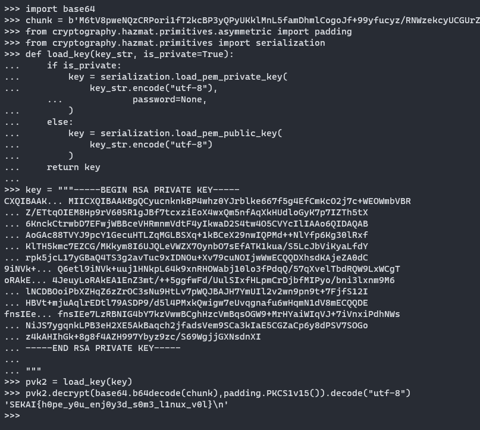

## Brief Walkthrough

1. Create symbols for volatility3, vol2 will not work because of kernel version 5+
2. `linux.bash` for bash history, python3 interactive console was opened
3. `linux.pslist` to get pid of python3 process - 2055
4. `linux.proc` has a dump option, so do `linux.proc --pid 2055 --dump`
5. Check heap dump, you can either dump strings from there or simulate a python3 process on your own machine to check for variable pointers in the dump
6. You should be able to notice there variables: c,k,type
7. xor c and k to get privatekey, decrypt response packets in pcap with that

[Key files](https://gchq.github.io/CyberChef/#recipe=From_Hex('Auto')XOR(%7B'option':'Hex','string':'6b7ffbd528357a8a40c6bc1dea24997bb48aadeb6ba006b21f9fe489e50494c921d23850686bf77b58f9a904cdfee19aae3accfef77d812219f33dab6badd28b'%7D,'Standard',false)&input=NDY1MmQ2ZjgwNTc3M2ZjZDA5ODg5YzRmYjk2NWI5MmJlNmMzZmJhYTNmZTUyNmY5NWFjNmM5YTRjODI5YjljMzZjOWI3MTEzMzAyYWJlMzkxOWI4ZTI0NmFhYWZhMmE4ZjQwZjhmYjlhNjJhYjE2NTdlODA1NGUzMjBkYWJkZmUwYzMwYmVhNTYwNDYyZmE1Mzc4NWU2MzZiZjFjZGExZWM3YmVjMTkxM2NjMjdlZGU0N2U4YmNmMDkyMmZmY2FhMmI5YTU0M2QzZDIyYmUzMzI5OWRjNzU3ODJjZDliYThlYTBjYmNkMWI2MmNjYjQ4NzZiYzZkZDIyODlkOWZiYjI3MWE4ZmJhMTk3MDI5YmUzNGE5ZGE3Zjk5NzdlOTAxOWJjMzk1OGMyOWQ2NzFmZDVjZDBhZGUwZDE2N2M2OWY0MmQ4NjkzZTU4MWY5YzNkMmRiMmM0Njg5YTkwYWJmNGMxMTFiZDkzYmYyYmY4Njg3Yzk5NmFjOTI0YzM4MGNmMDAzZGFlODc1ZTdiMGFiZDJlYTc4YTQ1ZGE1ZGFlMTI4Y2VjZWY5ZjNkYzM2M2YwMmVjY2ExZDhhYzQwZDU5ODYwOTAzMjExMDcyY2I2MjMzMGIyOWU3NmJhYjdjZWNiZTc2OGE1YzdjMjMzZmI2MDU3OTk1N2Y5NWFjM2I0ZGUzODExYmFhNjYyNmYwMmRkMTdhMWNhNThkZjQ2ZDQyYzg1ZmNlMjk5MzI5Mzc1ZWI1MWM2ODlkZGI0NjdjM2UyNDVlMzRjNWE1ZjQwYjAxMjY4YmM5YzRlOTc5YWI5ZThlYzRhYTE5YWFlMWZmMTQ3NzE5NTY4ZGUzMWVlOTdmODE5Mzg5NDliNDEwNjJlYmQwN2E0ZGE0NWE0MTZkMjI4ZjZmM2U3YWMwZDk5NTRkNjcxYzk4MmM1YmY0ZmM0OWM3MTg2N2M2ODYyM2Y4NzJiM2RhOGVjNTdiN2E2YjVjMmU5MDI4ZGM4OTUyN2IzNTA1YWIwNWNmYzNhYzRhMGZhMDg0OTljOGM1MDUxNTVjMTc4ZWQ4YTRiYTkxZGQ3NDhmY2U2OTlhZTI4ZjE1N2Y2N2NhOWFjZTZhNDU2YTdmZTQ1ZTY1NDE2MzE2MWQ4MzgwMjlkZDg1NDg2OTRkMmRjZjQwZTg1YjhiYjA3ZjExNDJhYTE3MmMzMzljM2UwZGQzZTU0YjM5ZTUwNTQyZGYyMGNhNThmNzBhYjBmYTAyMWQyYmNlZTlmMWY5MzU1ZGEyYWFlOTZiZmEwM2RmMGI5NGNiYjZiMDIwMzAxZmQwODBiODBjYTUyOWM4Y2FmZGJjNTdmOGRjZWM1M2JjYTYwMmZhNTQ0OTk1MjlmOWFlYTA3MmZiZDljN2IwNTBiYzYxYWU5YzU1ZTg4NjllOTM5ZjJmMjlmOWUzYzkyNzJjMzUxYThiZGU4ZDE0ZmM0YjM0ZDg3NTYxNTBlMTNjMjcxMzFiNDgyMzRmNDk3YTVmNGQ0NGU5NDlkYzEwNWUzMTc3NDlmMGU5MzBmZWNiYmQ4MDAzN2JjZTM0YTY3MGZmOTE2OTdmNjVmYWI2OWFlMTk4N2ZkZGNhNTVkZTkzNWMxNTlkNWE4YzBhYzM0ZDE4MTZhOTg1YjIxMDA1Mzk4MTk1MmI0ZGI0ZGY5YzliNWY1ZWI3N2FiYjliNjQ1ZDI2OTc1OWI2ZGRmMDFmYmE1ZTc0MDMzODM5NDQ0NDAzZWVmMGNhOGU4NWI4YjZhZjgyY2M3ZDJjZThlMjFmODRjZGQ2ZGE5OWNhMmI2NDJkNmY5NDI4MzZmNjAyYjNhYjU0MjFkZjNmOTc3ZmRiMTk3ZmRmZDUwYmQ5OTk4MTRkMzQ1NWJjNzZlOTMxOWNiZTZiMzUyMTE5ZGEwNjcwNTJiZWIwZjg3ZmQyYWIyMWNhMTMyYzRjZGM3ZGMxOTkzNjFlYjQ3YWE4ZmMwOGM2NWRkODI1OWI0NTAzMTE4MDA5YTU0NmY4MGEzNDk5Y2NjYjJjMGY5NGU4MTlkYTEzYWM4N2I0ODk4NzJjNzI1YzY5MWRhMmUxMThmYmI2MjYyMjhkYjJkOWNjYzRjYmExMGYwMmJmZGExZTA4ODVlZDAzMmMzNGNiNDk0ZGZhZTU1Y2NmOTQ3OWI3YjIxMjYwOTgzNDgzMmFiOWIwZWI0YWI5MmVmZjc3Y2Y0OWE5OTBiZjg1MjJkYzQwZjk5MGE5Yjk4ZWYwMTQ5YWRiNjAzNzIzMmU4MWE4OGNhN2Y4MDZmYzA0ZWY5ZThjNWJjMTFjZTM2OGYxNWIyYzlhNGM4MjlkMTg3NjVmMjZhMDMyOTRiYTcyOTExYWZlODUwODhkZWFhZGZmNzE3ZTFkM2RhNTA4YjVlMzRkZTEwODY0NmVmOTdjYzIyMzFkYjg1N2Q3NzM2YzMwM2U2Zjc1OGIzMDliNDU2OTlhN2E3YTYyMmU3NjBmZjVlYWZhM2NhYjY3NWQzOWE2OGIwMGIxNDM5MmViNTNhMDlhY2U4NDVmOWI5YWZkYmVhNzk4ZTk3YTYzNmMzNDU0OGIwNDRmMjBjOWE5NmYxMWExNThmODU2Zjc2MmZkZTZiYjc4ZjI1ODM3ZWZhMmFmMGZiZjdlMTJkZTMyZGRlNTZlNzk1ZTZjZTYzYTVlNjZlYmE2YzY0NWQyYWJhMmIyYzljYzgzNGE1OWY4M2NjZjQ2MmZiYzk4MDE1Yzc1MTQ4ODkwOGQxMmU5ZWI0ZGUzMzMzYTE5NjUyNzExNGQwMzBiMGM4N2I5ODEwYzA0M2ZlZDlkN2FjNjFjNDRhODU1MGFmOTVlZmQ2NGZkNTk4NjhiNDUzNjI1ZTMyYTYxZTEzYjZlNjZlYThiYmEyZDRjNzBmYjZhYjljNGVmNjQ0MzJjNjZjZmUzMWM3OGFlNTFkM2I5MWZlNmE2MDA4YmQ3OGEwZWEyOGRkNWVkNDBiZjdjOGM4ZGQ1ZWFhMmRkZjRiZjZhNmY5YTM2ZmVlYmE2Zjg2NjEzZjQzM2Q4ZjBjMTFiZGU4NTU4Y2JjZWJiNzgzMTdlMWQzYjIzM2M1MDI0OWE2N2ZlNzIyZWVmMmMwMmUyNmQ2ZjgwNTE4NTc4MDNjZWI5MTMwYzcwOWRiM2VmM2MzZTNjYjM5ZjM0NzkyNGZjZGFkZGZhNDUwZDFlOTZhOTc2MTdkNDU0NmRhNTY1MmI0ZTA0ZDhlYTZiMGQzZWM3YjhkYjViNTFhZDA2MTYwODY1ZWM1MDBjM2I5YzkzYjRiOGNiZDUyMDUyM2MwMzJhNGQwNzY4ZjEyYWY0Y2QyYmZjYWRmMmVjNjQ1ZGY1NGZjYWJiYjhmMzNmN2UyNzY5Nzc3MDcwNTA5YTEzOTBhZjNmMzJiODhhYTk1ZWJlMTczODliM2NmMzVmMTFiNmJhNTBiOWI1ZWZmZTNlYzIxM2Q5ZGUyNWM1NjAyZjAyOTgzZDM0NWRlNTNlMTJhZDliZmMzOGQyYWQxNWVkOTU3Y2E4MGU1OGE0M2VkODIxNmEyMGYxOTMyM2Y5ZjRlMmNhMWEzMzI4NjkwODJmMWVkNGViZTg5OTUzOWI2Njc1Zjg0NTdmYzI5ZWZiMWVlM2QzN2E5Yjg0NjU4MmNlZTM0ODA4ODY0YTM0ZmVlMWFmMGI4ZmVkZjFmZDczMmZkMmFkY2IyZDA4NjRkZjg4MDYwOTM1NzY2MzkyMmIzM2EwOWI4ZWIwZThjOTFhNmRiY2QwMmY0YWFhMTI0Y2IxYjY5OTA2NDlhMmNjOGIxZmUyMzJiYjc4ZjU5NzgzZGM2MDI5NWU0NmNjMTE1ZjIzOWY3ZWZmNWQ5NTJjZTcxZmI0ZWNmYTllZGNlMmZkYWE1NzhiNDQ4NjYyMzBjYzQ0YjM0YWJkMTYyYzdiNThkY2VlNjBmYTc5Mzk0NGFjNDc4NWFiNDEyZTYyMGM2YWJlNjUzMzZjZDgwNjI2NDM2ZWYxNjkxZTY0NWRkNmJlMDE1ZDZjNTlhOTgyZWM2NDdlNjU0YWU4ZmZjODQyYmM3ZmM2ZGIxNzIzMjNlMDJiYzAyMzliNWNmNjA5NGY0OTNlYWM1MGZhNjlkYmI0Y2I2NWI1ZWIxNWNmYTVmZjk4MWI4MGM0ZDlhYTM3YzQwMTliMzM4OGZmODUzYTU1MWIyMjNjMmJkOTQ4ODFlZWU0OWZiNzVlOGIzZmVhMDQ3YzU5ODY1OGE1MDIzMGMyMGI2MTEzZGEzZTgzNGE5YmRlYmNiOTg1ZmI4OTJjZTE0Y2Y3NDcyZDg0OGRlMDE5YzlhYzUwMDBmYjdlMzFjNWU0M2YyMmU5NGY0NTJiZDQ1ZmIxMTg1YmFjMTg0NThjNjU2ZDY2ZWNlY2JiY2QyNzVjY2JmNDRiZTZjMzIwYzM5YTYyYzYxYjVkMTUzOGU5OWI1OTA5YTcwYTk4YjhlMzFlZTcwNTg5ODc4ZWE1YWU4YmNkMTU4MTI4ZmZhMDMxZTRmZWQyN2EwY2I1YjhlMGJjYzBlZDhkOWU0OTMwZGU4NGFjMjcyZGM5NmNkOGY2NmYyODQ2ODgyNDEzZjQ3MDk5OTEyNmI5NWQxNmFhMGM3YWNhY2E0NTY4MmJkYjMzZmNlNGQ3MGEzNWZmMzMxZTVhM2QxNWQwNWExYTc2Nzc2NDlmOTBlYjM4NTU1OWU2OGVmNGNjNGRkZmNhMTI5ZTE0Y2ZhMjhjNjg5ZGNhYzY4YTZiZjEzYTU1NjY5MTgwNWNlMGY3M2NlZWY2ZWFiYWRkMGE4ZTczMDg0YmNhMTA5YWE0ZjczODY3Y2RhMDdkZjk3Y2YxZjEzY2NlYzY5NjYzZWRhNzllOWQ4Mjg4NjEwYzkzNmNjZTFmYzljMDJjNzcxODU3YWNhOTJmODgyNmFmNWFmNTRlNDRmMTgxOTA2Yjk0YTNjYWY5MTY5ODhiZGIwY2JlYTdmYzY5ODk5MGVjODY3N2NjNDcxZDEzOWVmOWNjMjJjNGI5OThjMWY1ZTAwZGMzN2IxZmU1ZThkNGNkMTAxZDdkY2MwYTkxYWQzNDlmNTQ4YTZjZmM0OTc0Y2NkYTg0ODg1NzEyMTNlMjFkYzRjMzFhZmM3N2NhNGFlODVmMmUwNmRiZmY0YjkxNGNiNzEyZThhNWFkYTA1YzY5ZWRiMjk0YzllOWQxYTZkM2ZiZjAxYWRmZTdjOWI0N2YxNDlkZWVjY2M4ZjE4ZjY2M2RmMjZjY2E3ZThkNjZmZGRhODY0ZTc3YjE3MzIwYWI0MGI2ZTgwOTE2MDlkYWRiN2FkZmQ3NThiOTFmZDA3YjU0OTU4YmI3NGMzMmNjNmY5YjMwYzQ3OWRlMTY5NmYzMmIzNzlmMWU1N2Y5MzVlYTAwMWQ3YTVmZWRkNTJmNzYxZDg3NWQ4YmNjNzk2NjBmYTkxNjhkODE1N2Q0NTQ2ZGEzZTE2YmQ4OTU2OWViZmMxY2FmYzczOWFiZmEzMzhhMTY5NWNhYTEwODY0NjgwZmY
)

`SEKAI{h0pe_y0u_enj0y3d_s0m3_l1nux_v0l}`