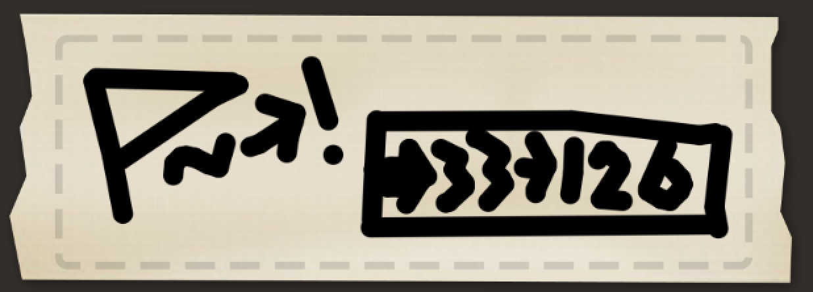

### Solution

All sorts of hint in the question suggests that this is a piece of source code for the [Human Resource Machine](https://tomorrowcorporation.com/humanresourcemachine) Assembly language. Comments in the code shows that the input is the flag in ASCII integers. The code performs an XOR of the input and the sequence [75, 70, 65, ..., 0] and compare them with the data on the floor. If all values match, "check mark” will be sent to output, otherwise “cross” will be sent.

Values in the memory (floor) are written on the labels. 

The code implements a logic similar to the following code:

```py
floor = [...]
counter = 21
multiplier = 18
wrong = 24
correct = 23

while floor[counter]: 
    a = floor[counter] * floor[multiplier]
    b = inbox()
    if a ^ b != floor[floor[counter]]:
        outbox(floor[wrong])
        exit()
    floor[counter] -= 1
outbox(floor[correct])
```

`SEKAI{cOnGr47s}`



### Credit

Game screenshot from Human Resource Machine by [Tomorrow Corporation](https://www.tomorrowcorporation.com/).
