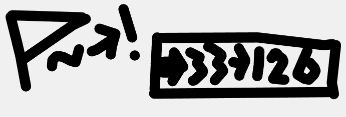
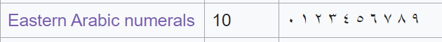
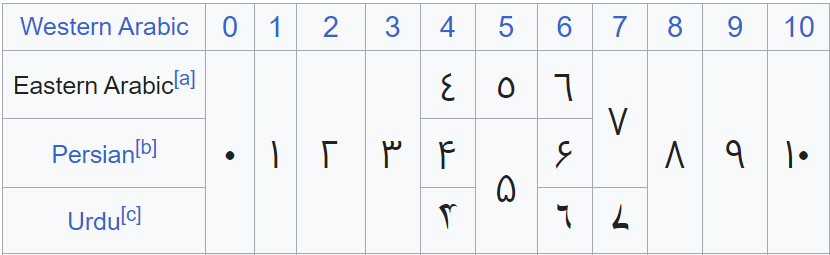

## Solution (by sahuang)

This is tester's writeup on the challenge. There are a lot of approaches to this challenge and I will only be covering the one I used.

### Initial Analysis

We are given a txt file with the following contents:

```
    COPYFROM 22
    COPYTO   20
    COPYTO   19

......

DEFINE COMMENT 0
eJwrZWBgSOY+pVsodLm5XWzuMSCXoYEnRSvB/rUeiK0vzNy30eKZ/S/HQCMQv1yzfNY1zYc9BTpfWrz1
LjcvNhRru2bG3NdjlTFRzVa6FKQm321R5TFP27JjYSYxID6jz2X3lnDV4FchRfk6IbkNILHS2PMyR5OF
okHsBakbm0C0UYVJjMJ+oej097w5EV9PZoLE9haXXdv/SfAyiP3pO2/Ozy8b9pV+m3EdxP9eKhQtU5Jx
FsS+VbJmcle12wSHehD+N6+pjmcFbxXPCv/Kk0tPV/2bB1IT2xA6s7rRbYJl07PqFx0zZue035n7vrV1
sUyj926QvHTfs+pTU8Ta3k9aM5l1euti1uk8K0Qmsu/81q+5CyQvNbsoP3TutsKORc+qk5fkNhxacrk5
e+GayYeW3Jl7f+nyJe/ms+8EqfNdmzHxz+ZzU0Ds5I03iq5v3d99favbhEMbi1Yf2nh9HUjc9sCiynv7
Bacf3PdzPYivfjKqI/G0Vt29M1p1O899afl8oaZz00XV/qCLaya7nFq0teDS0+0gdWqPGyvE7+itFL8z
ec3rB4u2Oj95uv3X88lrxF8uXxL54s5cxqddkxhGwSggAQAAS0PLkQ;

DEFINE LABEL 0
eJxTYmBg2OIXo+bgdU0xzSZTv9i8zaXZ0CiFSz+zm0v/x1QmI9HVn8w37Euz2Xv8ovPJC3u8z11mAIGk
EIXIglsNm+pOXlhff+0mSGhT3S2Vr6n9y3hjY+6B+E0Tzkr/mxijVjX5kdaDOYoRm9fq7dVff/AUSM5k
7UGh8AU7M35MFl3d0m9/koFIcKnFKZW3XSHFvTMlbX7Posp/PZeb5/dYtB/u2t89oXV/963GLy2xDVp1
8+vjyx/WmcTENjAHhTVbeL9v/epxs0/c61u/hbffZPcQt2lRPpWzo3z65z8M4F4I5C82iWFZkpLmuyBj
osH8yCMguxakrpW2yhCSL8n6r5abW2ysnRdv3ZV3N1E770sLX275LL7cLwe68swPPyqMPFJSXn10a3Pk
kdC5bmdAeu+dOZlpdvhk5pK9+rmrd9mWhWz/0lKx9dWyiq3sO79u+3LAZ9f+41EHz164dv79xcXXmU7d
vVl99Nod790C918tO3dfcPq5+w97gu5tbJp9K778wI2fxTvPvc4iNoxGwSggBQAAtyS7MQ;

DEFINE LABEL 1
eJzTYWBgMPa/pRLg4i8b6nRJLtsqRafYvND0j3GbS7Ph7OA2gy2pbQYH8/4bMcypMF2ytcDC/uQbS+cz
Nx18LgU7X7rm7HnpGtAIBtGoWyoCMd8tmRL1Ei8V+VwCiZ0tuaWSlr0ksi6panpbvNKWaZHOZ0Diy5su
yc1vLTQV61SLrposue7zVL29H6advACSS58Vofxi5iMtiY4fU9Wa1+w2q712EyR+YEWIwt6VEHNHwSgY
BdQDAC40R+0;

......
```

At first, one might think those labels "ciphertexts" are standard base64 encoded strings, however they cannot be decoded. Searching for the instructions with keyword `"BUMPUP" "JUMPN"`, and re-checking the challenge title/description, we know this is a piece of source code for the [Human Resource Machine](https://tomorrowcorporation.com/humanresourcemachine) assembly language. The goal seems to reverse the assembly from this game.

If one has never played this game, I would recommend have a go at it or at least watch the gameplay tutorials. They may be very helpful. Essentially, all those operations/instructions are performed on the input and output is the result. 

### Decoding the labels

There are plenty of tools that can decode labels or comments from the game and displays them as image, one of them being [hrm-tools](https://nrkn.github.io/hrm-tools/labels-comments/). Decoding the comment gives



Which tells us flag string is converted to ASCII numbers from 33 to 126, and they are stored in inbox. We are now able to continue decoding the labels. As per hint, those images were essentially some different numeral systems which you can found on [List of numeral systems](https://en.wikipedia.org/wiki/List_of_numeral_systems).

- Labels 0,1,2: Without reading the Wikipedia you know this is Roman numerals. 

```
CXX -> 120
CXXI -> 121
LVI -> 56
```

- Labels 3,4,5: Quick browse at the Wikipedia page will reveal this is Eastern Arabic numerals. (Also, it seems Copilot can decode it given the symbols)





```
٣٢ -> 32
١٠٧ -> 107
٨٩ -> 89
```

- Labels 6,7,8: Seeing many dots there, we can instantly recognize this is Braille. Note that all strings start with the `#` symbol, which is essentially the prefix and we can ignore it.


```
⠼⠛⠛ -> 77
⠼⠁⠚⠉ -> 103
⠼⠛⠓ -> 78
```

- Labels 9,10,11: Again, check the Wikipedia, this is Indian numerals, and more specifically [Devanagari](https://en.wikipedia.org/wiki/Devanagari).

0 to 9 maps to `० १ २ ३ ४ ५ ६ ७ ८ ९`.

```
७३ -> 73
१२६ -> 126
१२५ -> 125
```

- Labels 12,13,14: Looking at all 3 of them, we know they are just Greek numerals.

```
Ιʹ -> 10
Γʹ -> 3
KΔʹ -> 24
```

- Label 18: Chinese writing of 5.

- Label 21,22: 14 and 0.

- Label 23,24: These are the check mark and cross mark.

### Solve the challenge

Now, there are several ways to approach the challenge. A difficult (but may be easy for some?) way for myself is to actually understand the assembly and do a hard reverse. I went for another path which I will explain below.

With some searching, I found [Human Resource Code](https://esolangs.org/wiki/Human_Resource_Code) to be an esolang explained on esolang wiki. The layout and instructions are very similar to the actual game, with a few differences (that we will manually correct later on). In "External Resources" section, it provices a [Python Interpreter on TIO](https://tio.run/##nVXbctowEH2Ov0KjJ7sxDPSOkzwQQlvaYnu4TC/Uwxgjgqa27LGdhkwm3053JUOMSWia4cHSnt2zu0fSktzky1i8Wq8XaRyR7CYjPEriNCd@evlHC@I5I2dyPWl69SwJea7TX4IamhaEfpQACJ/Z3Ccri0T@So@40FcmabVahklq@NG00J@xMAPX2zttEack5IJNxVVkyhXhgjDYsdTPmY4ZDUs74gsJ1pmYZ9c8X@rUomg/UmQTBCdWrel5WEJBqGlczOIVWCaetmThHFZ2LJgW@GnCcrQ3PPKCNF@@B1csvqFdL3kINSTklIRMbPMHEQbjbsITT9YjTWeEtodfKFYCCcGFi1znIrnKdcMAoyyg7icJFK5LiXTwQ4iFuxzD0aBnf5RMqupjKE9FxCnEGgZBsQLUp0jgVRM0qrw9@9z5LjmL9pV7Eif7vs54tHFOUmwDQ0w4C4yj8ANfnnGR5b4IWIGCn0HgABih1LhPI1Xe0tchJM2Lc@s47o@RQ9TpBSwMC9HAb/LO8pBEHc8EQTxO5DxA9mHg9Et0U@FHeEmRr2V59zXdgsqdXm86dt3uYNqmFkFdaZsaJjgdFehX51sZ9XfRodvudAEjCiW76M/uwJGgQhvUuKtfMmhtU5a8EQvZEEgpVcKyqzK0lAybwstyPKJD@@LiYUVfKyrJdFyl2iaQtww3xiP8w/H5v/lrz@c/H/fdsfv0SwGtNPcvispTNh7Kd2E/PV/t//PJNzUcOa58UbOU@b8r4MjpfGoPyq8zWKZVmQpPe9wvO@L9OqTnCTUIDou959Lvd@1R0XfiZ1kpfm@0VvAy0WfQr2DhaujLKYzyvbE870DUTwgjPswU1QmM3IdI3h4msXdITp/F0dlw7M20LE@NxwnBirdvvV6fyP8DchmzDApJmanm8nZAmyS@yguDWv0F) which we will be using.

Here are a few things I modified to the Python interpreter, so it actually worked with the given instructions:

- Implement "ASKCHAR" instruction to replace "ASKSTRING" - because we ideally want to brute force the solution character by character. As we can see from the assembly, it checks on some conditions and then `JUMP` to either checkbox or crossbox. Therefore, if we can somehow do it by character, it will be easy to find the solution.

- Original implementation only accepts character for "COPYFROM" by `ASCII_` prefix. In our case, since numbers on the floor can be non-ascii, I changed it to accepting `NUM_` as prefix.

- Original implementation does NOT implement the `[i]` symbol, which is basically taking `x[x[i]]` instead of `x[i]` when called. e.g. `SUB [21]` means subtracting whatever number is currently on `floor[floor[21]]`. We thus added a check to it.

[Here](https://www.diffchecker.com/zLASz7V0/) is the diff of the code and you can view it on `Diffchecker`.

With this set up, we can verify the code works by running `solve.py` against `text2.txt` first - which is a piece of code I took from solution of some in-game level available online that calculates the absolute value of input.

```
a:
ASK
INBOX
JUMPN b
JUMP c
b:
COPYTO 0
SUB 0
SUB 0
c:
OUTBOX
JUMP a
```

```bash
$ python3 solve.py 
8
INBOX::: 8
OUTBOX::: 8
-10
INBOX::: -10
OUTBOX::: 10
```

Definitely works! Now we can construct `text.txt` from `instructions.txt`.

- Add the numbers to be copied to floor at beginning of the script
- Unindent the code because the interpreter doesn't check for indentation (lol)
- Change checkbox/crossbox index to 666/444 for easier reading

```
COPYFROM NUM_120
COPYTO 0
COPYFROM NUM_121
COPYTO 1
COPYFROM NUM_56
COPYTO 2
COPYFROM NUM_32
COPYTO 3
...
COPYFROM NUM_5
COPYTO 18
COPYFROM NUM_14
COPYTO 21
COPYFROM NUM_0
COPYTO 22
COPYFROM NUM_666
COPYTO 23
COPYFROM NUM_444
COPYTO 24
```

Now, if we run the code, we can see only correct input allows us to continue:

```bash
$ python3 solve.py 
S
INBOX::: 83
E
INBOX::: 69
i
INBOX::: 105
OUTBOX::: 444
```

Outbox 444 means crossbox so we failed the check. Otherwise we could continue. You can definitely write an automated script for this, but I am too lazy and we can get the flag from half guessing and trial and error.

```bash
$ python3 solve.py 
S
INBOX::: 83
E
INBOX::: 69
K
INBOX::: 75
A
INBOX::: 65
I
INBOX::: 73
{
INBOX::: 123
c
INBOX::: 99
O
INBOX::: 79
n
INBOX::: 110
G
INBOX::: 71
r
INBOX::: 114
4
INBOX::: 52
7
INBOX::: 55
s
INBOX::: 115
}
INBOX::: 125
OUTBOX::: 666
```

We got the flag! `SEKAI{cOnGr47s}`. A really fun challenge in my perspective.