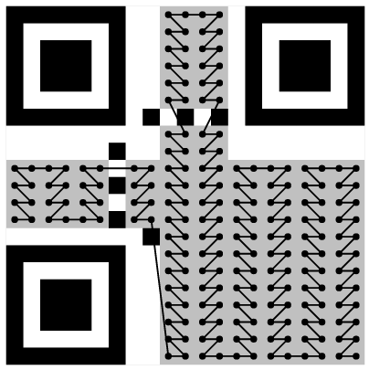
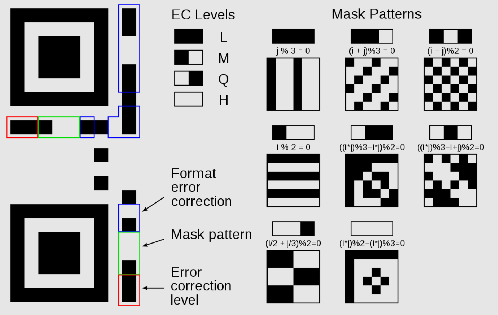
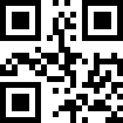

First thing solver will do is to try and scan the QR code, it won't work. The description of the challenge has few keywords which will drive solver's thought process

1. reconstruction (I need to correct this QR code somehow)
2. bits (All the bits are given, nothing damaged)
3. Gutenberg Diagram (What?)

Solver is expected to search about Gutenberg Diagram if he doesn't already know. It is a fancy term for 'Top to Bottom, Left to Right'

**Inference:** The friend was given QR code bits, instead of correct way, he arranged those bits top to bottom, left to right and expected it to work. It doesn't.

**TL;DR:** Research on how QR bits are arranged. Note down the given bits as per Gutenberg Order. Rearrange them as per correct order basis QR Version 1 specification. Decode. It doesn't work. Research on QR Masks. XOR bits with Masks 0-7. Decoding after applying mask 0 gives flag

**Solution:**

First thing solver naturally does is to research on how QR code bits are arranged. This is QR code version 1, I included the easiest version so that solving doesn't become a slog if you know the basics.

A QR code version 1 bits are arranged like this. It starts bottom right and ends at mid left.

(source: nayuki.io)

First block of 4 bits is the mode, Next block of 8 bits is length of data, then Data and Error Correction blocks follow. There are also functional blocks in a QR which detail out Error Correction Level and Mask used

(source: wikipedia)

Solver notices that functional blocks are not there in the given QR code. We should not need error correction since none of the blocks are damaged, but we will definitely need the mask since a QR code reader needs to know the mask value to interpret the code

Let's write down the bits first. Remember top to bottom, left to right

1101  
1000  
1001  
1100  
1010  
1101  
0011  
0010  
11010010011100100000  
11100010110111101010  
01100000001000111001  
00101010111100011010  
110111110100  
001101100001  
010010010111  
101001011000  
110001000010  
010001011011  
011110000101  
101100011011  

Joining them all together we get

**Masked QR Bits**
1101100010011100101011010011001011010010011100100000111000101101111010100110000000100011100100101010111100011010110111110100001101100001010010010111101001011000110001000010010001011011011110000101101100011011

Now arrange them in correct order as per QR Version 1 Specifications we get

QR bits are always masked, so scanning/decoding this without functional blocks won't work

Solver is expected to research
**Masked QR Bit = QR Bit xor Mask Bit**

We can easily reverse it if we know mask bits. Here we are not given mask pattern used, but we can easily check all patterns from 0 - 7. Again, I have used Mask pattern 0 to avoid frustrating the solver. If you know the specs, you deserve those points :)

**Mask Pattern 0 bits:** 1001100110011001100110010110011001100110011001101001100110011001100110010110011001100110011001101001100110011001100110011001011001100110100110011001011001100110011001100110011010011001100110010110011010011001

Now we xor the both to get

**QR Bits:** 
0100000100000101001101000101010010110100000101001001011110110100011100110000011001000101111101000011011010000011010001101101010100000111110100001110110000111110101000100100001011000010111000010011110110000010

First 4 bits are mode: 0100 - Bytes mode is used

Next 8 bit are data length: 00010000 - 16 is the length

Data bits follow that, so we extract the 16 bytes / 128 bits which will give us our flag

01010011010001010100101101000001010010010111101101000111001100000110010001011111010000110110100000110100011011010101000001111101

Flag: `SEKAI{G0d_Ch4mP}`