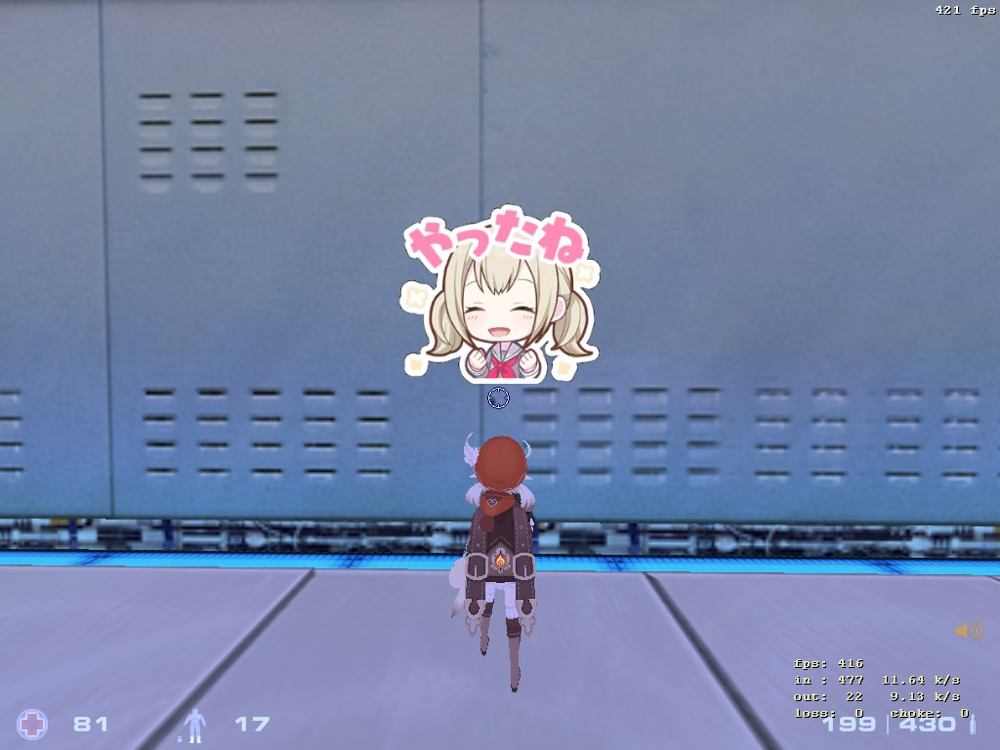

## Hibana

| Author      | Difficulty | Points | Solves | First Blood | Time to Blood |
| ----------- | ---------- | ------ | ------ | ----------- | ------------- |
| nyancat0131 | Expert (4) | 500    | 0      | n/a         | n/a           |

### Description

> Just text chatting is boring, so we made a plugin to introduce sticker communication to *GoldSrc*. Server owners can put their `.bmp` files in `svencoop/headicons` directory, and the plugin will automatically convert it to in-game format. When the game detects a chat message that corresponds to a sticker, it will be visible above that player's head. Our test server has a `yay.bmp` file, which will show up when a player types `yay` in chat.
>
> This plugin can also run on *Counter-Strike 1.6* and *Half-Life*, but to avoid copyright issues, we decided to use a free-to-play game. You can download the game client [here](https://store.steampowered.com/app/225840/Sven_Coop/). Please make sure that your exploit works locally with the provided setup, as remote server access may be slow for distant users. If you cannot move your character around when connecting to remote, try lowering your `fps_max` value to `100`.
>
> 

<b>Hint</b>

1. Why is engine_i686.so provided seperately?
2. The server turned off anti-cheat, so I think maybe can remove some client-side obstacles. Maybe can even call something normally not accessible from console?
3. The file transfer code of client and server are the same.
4. Try to understand GoldSrc filesystem a bit. Observe where the downloaded files are stored to. Also it doesn't use any pack file like .vpk, every file is stored directly on disk.

### Challenge Files

[dist.zip](dist)
